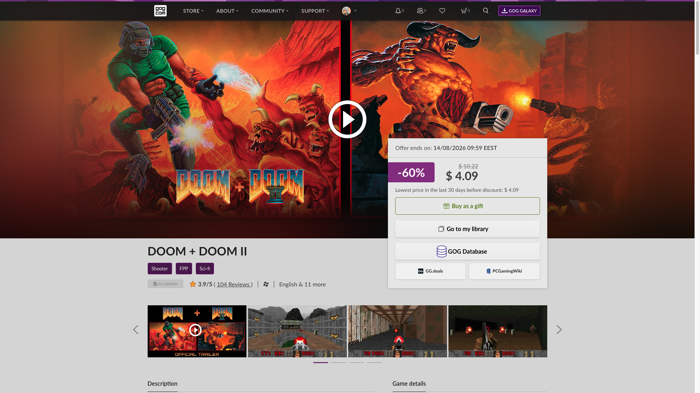

# GOG to GOGDB Button

Tampermonkey userscript that adds GOGDB, GG.deals and PCGamingWiki buttons to GOG.com game pages. / Userscript de Tampermonkey que añade botones a GOGDB, GG.deals y PCGamingWiki en las páginas de juego de GOG.com.

*Game page: the three buttons close the purchase column, styled like GOG's own. GOG Database takes the full width; GG.deals and PCGamingWiki split the row below it, at the same height. / Página de juego: los tres botones cierran la columna de compra, con el estilo de los propios de GOG. GOG Database ocupa todo el ancho; GG.deals y PCGamingWiki se reparten la fila de abajo, a la misma altura.*

## English

### What it does

Adds three buttons to the purchase column of GOG.com game pages:

- **[GOGDB](https://www.gogdb.org/)** — builds, product data, price history and store changes. It links to **that exact product**: the slug comes from the page's own `card-product` attribute, so the button lands on the game's GOGDB entry rather than on a search.
- **[GG.deals](https://gg.deals/)** — where else that game is on sale, and for how much. It searches **by title among GOG-DRM deals only**, since that is the DRM (or lack of it) of everything sold in this store, and it turns off the default store-rating floor so no offer is hidden from you.
- **[PCGamingWiki](https://www.pcgamingwiki.com/)** — compatibility, fixes, ultrawide and frame-rate notes. It searches for **the game itself**: without the edition suffix and, on a DLC or an edition, by the game it belongs to, which is where PCGamingWiki documents it.

Details worth knowing:

- **The last two are title searches, so they can miss**, and each says exactly that in its tooltip. The GOGDB button carries no tooltip: it is built from the product id in the page and cannot miss, and the brand name already says where it goes.
- **The name comes from GOG's own API, in English.** The store translates product names — `/zh/game/cyberpunk_2077` is announced as `《赛博朋克 2077》` — while GG.deals and PCGamingWiki index in English. The buttons are drawn straight away with the title read from the page (cleaned of the `Buy …` prefix, the `… - GOG.com` tail and trademark symbols) and the two links are rewritten as soon as the English name arrives; if the API does not answer they simply stay as they were. Accents are dropped for GG.deals only, because it transliterates in its own index, and kept for PCGamingWiki, whose articles keep them.
- **A DLC or an edition sends PCGamingWiki to its game.** GOG says which one in two different places: a DLC declares it in `requiresGames`, while an edition or pack declares it in its list of editions, where the plain game is the one named *Base Edition*. GG.deals does sell them separately, so it always gets the full name.
- **Placement follows GOG's own column:** whatever GOG shows there — buy, add to cart or "Go to my library" if you already own the game — GOG Database sits below it, and the other two form their own row under that, matching its height.
- The three read as native GOG buttons rather than an add-on. GG.deals and PCGamingWiki are real links, so middle-click and *copy link address* work.
- They open in a new tab, leaving the store page as you left it.
- Works whatever language you browse the store in: it recognises the game page with or without the locale segment in the URL (`/game/…`, `/en/game/…`, `/de/game/…`, `/zh-Hans/game/…`), and nothing it looks for on the page depends on the text being English.
- GOG is a single-page app, so the buttons are reinjected when you navigate from one game to another without a full reload — and the previous game's ones are removed, so you never get a button pointing at what you were looking at before.

**Language:** the labels are brand names, the same in every language. The two tooltips come in **7 languages** — English, Spanish, German, French, Polish, Russian and Chinese — taken first from the locale segment of the URL (`/de/game/…`), which is an explicit choice and travels in any link you share; then from `<html lang>`, which covers the paths without a segment; then from your browser, falling back to English.

**Install:**
1. Install [Tampermonkey](https://www.tampermonkey.net/).
2. Open the installer: [gog-to-gogdb-button.user.js](https://github.com/g31w0fw0rld/gog-to-gogdb-button/raw/main/gog-to-gogdb-button.user.js) (also on [GreasyFork](https://greasyfork.org/es-419/users/1590477-g31w) and [OpenUserJS](https://openuserjs.org/users/g31w0fw0rldgmail.com/scripts)).

**Site:** `gog.com/…/game/*` — any store language, with or without the locale segment.

## Español

### Qué hace

Añade tres botones en la columna de compra de las páginas de juego de GOG.com:

- **[GOGDB](https://www.gogdb.org/)** —builds, datos de producto, historial de precios y cambios en la tienda—. Enlaza a **ese producto concreto**: el slug sale del propio atributo `card-product` de la página, así que el botón cae en la ficha del juego en GOGDB y no en una búsqueda.
- **[GG.deals](https://gg.deals/)** —en qué otras tiendas está de oferta ese juego, y a cuánto—. Busca **por título y solo entre ofertas con DRM de GOG**, que es el DRM (o su ausencia) de todo lo que se vende en esta tienda, y desactiva el mínimo de valoración de tienda que trae por defecto para que no te esconda ninguna oferta.
- **[PCGamingWiki](https://www.pcgamingwiki.com/)** —compatibilidad, arreglos, ultrapanorámico y notas de frame rate—. Busca **el juego en sí**: sin el sufijo de edición y, en un DLC o una edición, por el juego al que pertenece, que es donde PCGamingWiki lo documenta.

Detalles que conviene saber:

- **Los dos últimos buscan por nombre, así que pueden no acertar**, y cada uno lo dice tal cual en su tooltip. El de GOGDB no lleva tooltip: se construye con el id de producto de la página y no puede fallar, y la marca ya dice a dónde va.
- **El nombre lo da la propia API de GOG, en inglés.** La tienda traduce los nombres de los productos —`/zh/game/cyberpunk_2077` se anuncia como `《赛博朋克 2077》`— mientras que GG.deals y PCGamingWiki están indexados en inglés. Los botones se pintan de inmediato con el título leído de la página (limpio del `Comprar …`, de la cola `… - GOG.com` y de los símbolos de marca) y los dos enlaces se reescriben en cuanto llega el nombre en inglés; si la API no contesta, se quedan como estaban. Los acentos se quitan solo para GG.deals, porque translitera en su índice, y se conservan para PCGamingWiki, cuyos artículos sí los llevan.
- **Un DLC o una edición mandan a PCGamingWiki a su juego.** GOG dice cuál es en dos sitios distintos: un DLC lo declara en `requiresGames`, mientras que una edición o pack lo declara en su lista de ediciones, donde el juego suelto es el que se llama *Base Edition*. GG.deals sí los vende por separado, así que recibe siempre el nombre completo.
- **La colocación respeta la columna de GOG:** sea lo que sea que muestre ahí —comprar, añadir al carrito o "Go to my library" si ya tienes el juego—, GOG Database queda debajo, y los otros dos forman su propia fila bajo él, a su misma altura.
- Los tres parecen botones nativos de GOG y no un añadido. GG.deals y PCGamingWiki son enlaces de verdad, así que funcionan el clic central y *copiar dirección del enlace*.
- Abren en una pestaña nueva y dejan la página de la tienda como estaba.
- Funciona en cualquier idioma de la tienda: reconoce la ficha de juego con o sin el segmento de idioma en la URL (`/game/…`, `/en/game/…`, `/de/game/…`, `/zh-Hans/game/…`), y nada de lo que busca en la página depende de que el texto esté en inglés.
- GOG es una SPA, así que los botones se reinyectan al navegar de un juego a otro sin recarga completa —y los del juego anterior se quitan, así que nunca te queda un botón apuntando a lo que estabas viendo antes—.

**Idioma:** las etiquetas son marcas, iguales en cualquier idioma. Los dos tooltips vienen en **7 idiomas** —inglés, español, alemán, francés, polaco, ruso y chino—, tomados primero del segmento de idioma de la URL (`/de/game/…`), que es una elección explícita y viaja en el enlace que compartas; luego del `<html lang>`, que cubre las rutas sin segmento; luego del navegador, con inglés como respaldo.

**Instalación:**
1. Instala [Tampermonkey](https://www.tampermonkey.net/).
2. Abre el instalador: [gog-to-gogdb-button.user.js](https://github.com/g31w0fw0rld/gog-to-gogdb-button/raw/main/gog-to-gogdb-button.user.js) (también en [GreasyFork](https://greasyfork.org/es-419/users/1590477-g31w) y [OpenUserJS](https://openuserjs.org/users/g31w0fw0rldgmail.com/scripts)).

**Sitio:** `gog.com/…/game/*` — cualquier idioma de la tienda, con o sin el segmento de locale.

## Privacy / Privacidad

**EN:** the script sends nothing to third parties or to the author. From the page it reads only the product id and the game title, both used to build the links. It declares `@grant none`, so it has no access to the userscript manager's privileged APIs. It asks **GOG's own public API** (`api.gog.com`) for the English name of the product you are already looking at, and on a DLC or an edition also for the name of its base game: those calls carry only the product id, go out with `credentials: 'omit'` so no cookie or session travels with them, and their answer is kept in `localStorage` for 30 days so the same product is not asked twice. Two more requests leave your browser, both for icons: the GOGDB logo from `gogdb.org` and the GG.deals favicon from `gg.deals`, so those two sites see a plain image request when the buttons are drawn — nothing about which game you are looking at. The PCGamingWiki logo is inline SVG and requests nothing. You only visit any of the three sites if you click.

**ES:** el script no envía nada a terceros ni al autor. De la página lee solo el id del producto y el título del juego, y con eso arma los enlaces. Declara `@grant none`, así que no tiene acceso a las APIs privilegiadas del gestor de userscripts. Le pregunta a **la API pública de GOG** (`api.gog.com`) el nombre en inglés del producto que ya estás viendo y, en un DLC o una edición, también el de su juego base: esas llamadas llevan solo el id del producto, salen con `credentials: 'omit'` así que no viaja ninguna cookie ni sesión, y su respuesta se guarda en `localStorage` 30 días para no preguntar dos veces por el mismo producto. Sí salen dos peticiones más de tu navegador, las dos de iconos: el logo de GOGDB desde `gogdb.org` y el favicon de GG.deals desde `gg.deals`, así que esos dos sitios ven una petición de imagen corriente al dibujarse los botones —nada sobre qué juego estás viendo—. El logo de PCGamingWiki es SVG en línea y no pide nada. Solo visitas cualquiera de los tres sitios si haces clic.

## Support / Apoyar

This is part of something I'm building to grow. If it helps you and you'd like to support it, you can tip me on **[Ko-fi](https://ko-fi.com/g31w0fw0rld)** —only if you want—; and if a cause needs it more than I do, help that one instead.

Esto es parte de algo que estoy construyendo para crecer. Si te sirve y quieres apoyar, puedes invitarme un café en **[Ko-fi](https://ko-fi.com/g31w0fw0rld)** —solo si quieres—; y si hay una causa que lo necesite más que yo, ayúdala a ella.

---
Author / Autor: **g31w0fw0rld** · License / Licencia: **MIT**
